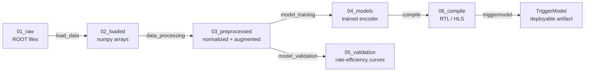

# CTL2 Embedding Model

Train a quantized **Linformer encoder** (Keras 3 + HGQ) for real-time anomaly
detection at the **L1 trigger** of the LHC, then synthesize the model into
**Verilog RTL** for FPGA deployment (Xilinx Virtex UltraScale+ XCVU13P,
5.556 ns clock, ~180 MHz).

The pipeline covers the full workflow: **data loading → preprocessing with
GSEAL augmentation → training with hardware-aware quantization → validation
(rate-vs-efficiency) → firmware synthesis (RTL + HLS) → deployable
TriggerModel**.

Built with [TriggerFlow](https://gitlab.cern.ch/maglowac/triggerflow) for automated, reproducible ML pipelines.
Note: Triggermodel abstraction not yet availible for this model.

---

## Table of Contents

- [Pipeline Overview](#pipeline-overview)
- [Installation](#installation)
- [Data](#data)
- [Configuration](#configuration)
- [Running the Pipeline](#running-the-pipeline)
- [TriggerFlow CI/CD Deployment](#triggerflow-cicd-deployment)
- [Model Architecture](#model-architecture)
- [Training](#training)
- [Validation](#validation)
- [Synthesis](#synthesis)
- [MLflow Tracking](#mlflow-tracking)
- [Project Structure](#project-structure)
- [Testing](#testing)
- [FAQ / Troubleshooting](#faq--troubleshooting)

---

## Pipeline Overview

The pipeline is structured as a sequence of Kedro pipelines orchestrated via
TriggerFlow:



| Stage | Purpose |
|---|---|
| `load_data` | Read ROOT files via TriggerLoader, convert to numpy arrays |
| `data_processing` | Normalize, one-hot encode PID, apply GSEAL augmentation |
| `model_training` | Train HGQ-quantized Linformer encoder |
| `model_validation` | PCA, anomaly scoring, rate-vs-efficiency curves |
| `compile` | da4ml RTL/Verilog synthesis + optional hls4ml HLS |
| `triggermodel` | Package all artifacts into a deployable TriggerModel |

---

## Installation

### 1. Create a conda environment

```bash
conda env create -f environment.yml
conda activate training-gpu
```

or 

```bash
Pull Docker container(s) from: https://gitlab.cern.ch/ml_l1/ctl2_embedding_model/container_registry/29293
```

The environment includes Python 3.11, TensorFlow, Keras 3, HGQ, da4ml,
hls4ml, Kedro, MLflow, and TriggerFlow.


### 3. Set environment variables

```bash
export KERAS_BACKEND=tensorflow
export PYTHONPATH=$(pwd)/src:$PYTHONPATH
```

---

## Data

### Raw format

Input events are stored as ROOT files under `data/01_raw/`. A
`data/01_raw/samples.json` file defines which samples to load:

A `settings.json` file controls the execution backend (Local, Condor, or
Kubernetes). Recommended is local with many CPU cores.


### Data tiers (Kedro convention)

| Tier | Directory | Contents |
|------|-----------|----------|
| 01_raw | `data/01_raw/` | ROOT files + samples.json + settings.json |
| 02_loaded | `data/02_loaded/` | Numpy arrays after TriggerLoader |
| 03_preprocessed | `data/03_preprocessed/` | Normalized + GSEAL-augmented, PID one-hot |
| 04_models | `data/04_models/` | Trained `.keras` model + history |
| 05_validation | `data/05_validation/` | PCA plots, rate-curve JSON |
| 06_compile | `data/06_compile/` | Verilog RTL + HLS project |

### Data splitting

Configured in `conf/base/parameters.yml` under `load_data.splits`:


### Preprocessing

1. **Normalization**: log1p on pT, min-max on eta/phi; zero-padded entries are masked.
2. **PID one-hot encoding**: PDG IDs mapped to N-class one-hot vectors.
3. **GSEAL augmentation**: Lorentz boosts + 3D rotations applied on the fly.
4. **Output**: `(N, 100, 12)` — 4 kinematic features + 8 PID one-hot channels.

---

## Configuration

All pipeline parameters live in `conf/base/parameters.yml`:

```yaml
# Data loading
load_data:
  n_particles: 100
  n_features: 5
  splits: { ... }

# Data processing
data_processing:
  n_constituents: 100
  n_features: 12
  n_classes: 4
  augment: true
  rotate: true
  boost: true
  beta_max: 0.95

# Model training
model_training:
  latent_dim: 16
  proj_dim: 16
  ff_dim: 32
  num_heads: 2
  proj_k: 8
  epochs: 400
  batch_size: 64
  initial_lr: 0.001
  nce_start: 0.05
  nce_end: 0.7
  nce_warmup: 50
  nce_hold: 100
  temperature: 0.1
  mse_weight: 0.1
  beta_schedule:
    - [0,   0,     'constant']
    - [100, 0,     'constant']
    - [150, 5e-8,  'linear']
    - [200, 5e-7,  'linear']
    - [250, 6.6e-7,'linear']
    - [400, 1e-5,  'linear']

# Validation
model_validation:
  rate_threshold: 16.0
  n_neighbors: 5
  eval_names:
    1: suep
    2: hh4b
    4: zprime
    5: svj_m250

# Firmware compilation
compile:
  fpga_part: "xcvu13p-flga2577-2-e"
  clock_period: 5.556
  io_type: "io_parallel"
  backend: "Vitis"
```

---

## Running the Pipeline

### Locally

Run individual Kedro pipelines:

```bash
kedro run --pipeline=load_data --params run_name=my_run
kedro run --pipeline=data_processing --params run_name=my_run
kedro run --pipeline=model_training --params run_name=my_run
kedro run --pipeline=model_validation --params run_name=my_run
kedro run --pipeline=compile --params run_name=my_run
```

Or run the full pipeline:

```bash
kedro run --params run_name=my_run
```

Visualize the pipeline:

```bash
kedro viz run
```

---

## TriggerFlow CI/CD Deployment

The project includes GitLab CI configuration for automated pipeline execution.

### Docker image build (`docker_build` branch)

Two Docker images are built via Kaniko:

| Dockerfile | Tag | Contents |
|---|---|---|
| `Dockerfile` | `Prod` | Training + inference environment |
| `DockerfileFW` | `FW` | Firmware synthesis environment (Vivado + hls4ml) |

Push the `docker_build` branch to trigger the build.

### Pipeline execution (`master` branch)

The CI pipeline runs on the `master` branch and consists of 6 stages:

```yaml
stages:
  - load
  - preprocess
  - train
  - validate
  - compile
```

### Required CI variables

Set these in **Settings > CI/CD > Variables**:

| Variable | Description |
|---|---|
| `EOSUSER` | CERN username (masked, protected) |
| `EOSPASS` | CERN password (masked, protected) |
| `MODEL_NAME` | GitLab project name (`ctl2_embedding`) |

### Launching a run

1. Go to **Build > Pipelines**
2. Click **New pipeline**
3. Set the variable `RUN_NAME` (e.g. `v1.0`)
4. Start the pipeline

Pipeline outputs include a deployable TriggerModel artifact.

---

## Model Architecture

The Linformer encoder reduces the quadratic complexity of standard
self-attention from O(N²) to O(N·k) by projecting keys and values to a fixed
dimension `k`. All layers use HGQ quantization.

```
Input: (N_particles=100, n_features=12)
│
├─ QDense(32, relu)                     ── particle embedding
│
├─ QLinformerAttention(num_heads=2, proj_k=8)  ── multi-head attn, linear KV proj
│   └─ QAdd residual
│
├─ QLinformerAttention(num_heads=2, proj_k=8)  ── second attention block
│   └─ QAdd residual
│
├─ QSum(axis=1) / N_constituents        ── aggregate over particles
│
├─ QDense(32, relu)                     ── feed-forward
├─ QDense(32, relu)
│
├─ QDense(latent_dim, name="latent")    ── latent representation
│
├─ QDense(32, relu, name="cls_hidden")  ── classification hidden (truncation point)
│
└─ QDense(n_classes, softmax)           ── class probabilities
```

~224K total parameters, ~133K trainable.

| Scope | HGQ Setting |
|---|---|
| Default | k0=1, b0=8 bits, i0=1, WRAP overflow, MonoL1(1e-8) |
| Datalane | k0=1, f0=6 fractional bits, MonoL1 on activations |
| Attention | RND rounding, SAT overflow, MinMax(1,8) bitwidth range |

---

## Training

### Loss function

```
total_loss = nce_weight * InfoNCE     # contrastive learning on augmented pairs
           + 1.0         * CE         # cross-entropy classification
           + 0.1         * MSE        # consistency: original vs augmented latents
           + 1.0         * HGQ        # hardware regularization (beta-scheduled)
```

### Learning rate

Cosine decay with restarts:
- Initial LR: 1e-3, decay to 1e-5 over 30 epochs
- Each cycle multiplies amplitude by 0.8, restarts every 30 epochs

### NCE weight schedule

- **Epochs 0–50**: linear warmup 0.05 → 0.5
- **Epochs 50–150**: held at 0.5
- **Epochs 150–400**: cosine decay 0.5 → 0.25

### Callbacks

| Callback | Purpose |
|---|---|
| `NCEWeightCallback` | Schedules contrastive loss weight |
| `BetaScheduler` | Schedules HGQ beta per epoch |
| `FreeEBOPs` | Tracks equivalent bit operations |
| `TriggerRateCallback` | Computes signal efficiency at 16 Hz background rate |
| `ParetoFront` | Saves checkpoints with eff > 1% and EBOPs < 2M |
| `LearningRateScheduler` | Cosine-decay-with-restarts |
| `TerminateOnNaN` | Stops on NaN loss |

---

## Validation

The `model_validation` pipeline produces:

1. **PCA of training latent space** — 2D projection of training classes
2. **1v1 PCA** — minbias vs each signal class
3. **Rate-efficiency curves** — anomaly score threshold scan

Anomaly scoring methods:

| Method | Description |
|---|---|
| `ClassifierAnomalyScore` | `1 - P(minbias)` from softmax |
| `KNNAnomalyScore` | Distance to k-th nearest neighbor in latent space |
| `MahalanobisAnomalyScore` | Negative log-prob under PCA + Gaussian |
| `CombinedAnomalyScore` | Weighted sum of classifier + KNN |

Target: **16 Hz** trigger rate at the L1 threshold.

---

## Synthesis

The `compile` pipeline converts the trained encoder into FPGA firmware:

1. **Model truncation** at `cls_hidden` layer (removes softmax)
2. **trace_minmax** calibration of per-tensor quantization ranges
3. **da4ml tracing + RTL generation** → Verilog for XCVU13P, 5.556 ns clock, 31 pipeline stages
4. **hls4ml** (optional) — may fail for custom `QLinformerAttention` layers
5. **Validation** — scatter plot of Keras vs combinational logic predictions

### Docker-based firmware build

The `build_fw` CI job uses `registry.cern.ch/ci4fpga/vivado:2024.1` to run
Vivado HLS on the generated Tcl scripts.

---

## MLflow Tracking

MLflow is configured via `conf/local/mlflow.yml` for experiment tracking:

```yaml
server:
  mlflow_tracking_uri: https://ml.cern.ch/models

tracking:
  experiment:
    name: maglowac-ctl2-embedding
  run:
    name: "${runtime_params:run_name,null}"
```

Each Kedro pipeline run is logged as a nested MLflow run, capturing
parameters, metrics, and the final TriggerModel artifact.

---

## Project Structure

```
ctl2_embedding/
├── pyproject.toml                  # Package metadata + Kedro config
├── environment.yml                 # Conda environment
├── Dockerfile                      # Training container (Kaniko)
├── DockerfileFW                    # Firmware container (Kaniko)
├── .gitlab-ci.yml                  # CI: docker_build branch
├── .gitlab-ci-master.yml           # CI: master branch pipeline
├── launch.sh                       # Convenience launch script
│
├── conf/                           # Kedro configuration
│   ├── base/
│   │   ├── catalog.yml             # Data catalog (typed datasets)
│   │   └── parameters.yml          # Shared pipeline parameters
│   └── local/
│       ├── credentials.yml         # mlflow credentials
│       └── mlflow.yml              # MLflow tracking config
│
├── data/                           # Data tiers (Kedro convention)
│   ├── 01_raw/                     # ROOT files + samples.json
│   ├── 02_loaded/                  # (generated) numpy arrays
│   ├── 03_preprocessed/            # (generated) normalized + augmented
│   ├── 04_models/                  # (generated) trained models
│   ├── 05_validation/              # (generated) plots + metrics
│   ├── 06_compile/                 # (generated) RTL + HLS
│   
│
├── src/                            # Package root
│   └── ctl2_embedding/
│       ├── __init__.py
│       ├── pipeline_registry.py    # Kedro pipeline registration
│       ├── settings.py             # Kedro settings (OmegaConfigLoader)
│       ├── data/                   # Data loading + preprocessing
│       │   ├── load_data.py        # DataConfig, load_sample(), load_data()
│       │   └── preprocessing.py    # Normalization, PID encoding
│       ├── augmentation/           # GSEAL symmetry augmentations
│       │   ├── coordinate.py       # Cylindrical ↔ Cartesian conversion
│       │   ├── lorentz.py          # 3D Lorentz boosts and rotations
│       │   └── gseal.py            # GSEALAugmentation + Keras layer
│       ├── datasets/               # Custom Kedro dataset types
│       │   ├── npy_dataset.py      # .npy file dataset
│       │   ├── keras_dataset.py    # .keras model dataset
│       │   ├── ctl2_loader.py      # TriggerLoader subclass
│       │   └── any_object.py       # Abstract object dataset
│       ├── models/                 # Neural network definitions
│       │   ├── linformer.py        # Linformer encoder
│       │   ├── contrastive_model.py# ContrastiveHGQEncoder
│       │   ├── losses.py           # InfoNCE, supervised contrastive, MSE
│       │   └── projector.py        # Projection head
│       ├── pipelines/              # Kedro pipeline definitions
│       │   ├── load_data/          # Data loading pipeline
│       │   ├── data_processing/    # Preprocessing + augmentation
│       │   ├── model_training/     # Training pipeline
│       │   ├── model_validation/   # Validation pipeline
│       │   └── compile/            # Synthesis pipeline
│       ├── training/               # Training orchestration
│       │   ├── trainer.py          # train_hgq_scratch()
│       │   ├── config.py           # Dataclass config hierarchy
│       │   └── callbacks.py        # Training callbacks
│       ├── evaluation/             # Post-training evaluation
│       │   ├── anomaly_score.py    # Anomaly scoring methods
│       │   └── plots.py            # PCA, multiplicity, rate curves
│       ├── synthesis/              # Hardware synthesis
│       │   ├── model_surgery.py    # Model truncation for synthesis
│       │   ├── trace_and_synth.py  # da4ml tracing, RTL/HLS generation
│       │   └── validate.py         # Keras vs comb-logic comparison
│       └── utils/                  # Utility modules
│
├── scripts/                        # Standalone entry points
│   ├── train.py
│   ├── evaluate.py
│   ├── synthesize.py
```

---


## FAQ / Troubleshooting

### Q: ModuleNotFoundError for ctl2_embedding

```bash
export PYTHONPATH=$(pwd)/src:$PYTHONPATH
```

